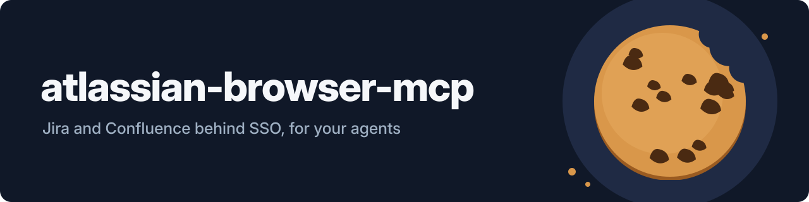

<p align="center">
  
</p>

# atlassian-browser-mcp

[](https://github.com/GeiserX/atlassian-browser-mcp/actions/workflows/ci.yml)
[](LICENSE)
[](https://python.org)
[](https://github.com/sooperset/mcp-atlassian)
[](https://glama.ai/mcp/servers/GeiserX/atlassian-browser-mcp)

MCP server that wraps the upstream [mcp-atlassian](https://github.com/sooperset/mcp-atlassian) toolset with browser-cookie authentication via Playwright, for Atlassian Server/Data Center instances behind corporate SSO (Okta, SAML, etc.) where API tokens are not available. It runs locally over stdio: you log in once with the bundled CLI, and the server reuses the cookies.

## Features

- Every mcp-atlassian Jira and Confluence tool, authenticated with your SSO browser session instead of an API token.
- One login per service with the CLI; the server itself never opens a browser, so it never hangs waiting for one.
- Seeds the automation profile from your real Chrome profile, so the first login is often one click.
- On macOS, reuses a live session from an installed Chromium-family browser (Arc, Brave, Edge, Chrome and others) without opening a window.
- Separate cookie jars for Jira and Confluence.
- A command-line front-end (`atlassian-cli`) for scripts and agents: get and search issues and pages.
- Falls back to token auth with `ATLASSIAN_BROWSER_AUTH_ENABLED=false`.

## Quick start

```bash
git clone https://github.com/GeiserX/atlassian-browser-mcp.git && cd atlassian-browser-mcp
uv venv --python 3.11 .venv-atlassian-browser && uv pip install --python .venv-atlassian-browser/bin/python -e .
JIRA_URL=https://jira.example.com CONFLUENCE_URL=https://confluence.example.com ./atlassian-cli login jira   # once per service
```

Then point your MCP client at the launcher:

```json
{
  "mcpServers": {
    "atlassian": {
      "command": "/path/to/atlassian-browser-mcp/run-atlassian-browser-mcp.sh",
      "env": {
        "JIRA_URL": "https://jira.example.com",
        "CONFLUENCE_URL": "https://confluence.example.com"
      }
    }
  }
}
```

Needs Python 3.11+, [uv](https://docs.astral.sh/uv/), Google Chrome and a display for the login. The server only reads the saved cookies; when they expire it returns an `AuthRequiredError` asking you to run the login again. Seeding from Chrome and every setting are in [Getting started](docs/getting-started.md).

## Documentation

- [Getting started](docs/getting-started.md): requirements, install, the first login, seeding from Chrome, the MCP client config
- [Configuration](docs/configuration.md): every environment variable and its default
- [Usage](docs/usage.md): the MCP tools and the CLI commands
- [How it works](docs/how-it-works.md): why login and serving are separate processes, and the files
- [Troubleshooting](docs/troubleshooting.md): symptoms, causes, fixes, and what to put in a bug report

## License

[GPL-3.0-or-later](LICENSE)
